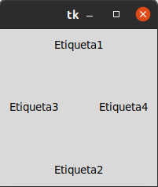
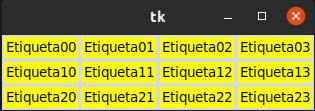
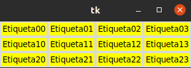
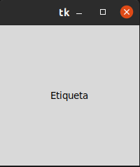

# Posicionamiento y Diseño

## Gestor de geometría pack

#### Este gestor de geometría distribuye los widgets en horizontal o en vertical.

## Gestor de geometría Grid

#### Con grid la distribución de los widgets se realiza de una manera más flexible, utilizand un diseño de cuadrícula. De esta manera, cada widget se situa en la celda determinada por la intercepción de una fila y una columna

## Gestor de geometría place

#### Este gestor permite colocar los widgets en coordenadas específicas de la ventana principal o del widget contenedor. 

