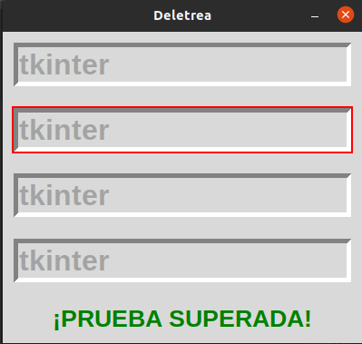
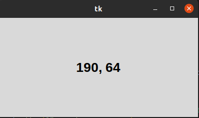
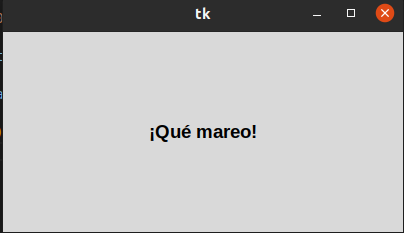

# Métodos Comunes

## Método Común Foco

#### Con este método, el programa cambia en cierta cantidad de tiempo el foco donde se escribe entre cuatro Entrys. Si se escribe lo mismo en todas, sin errores, la prueba es superada.

## Método Común Posición del Ratón

#### Detecta las coordenadas del ratón mientras lo movemos o lo dejamos estático, nos muestra las coordenadas de x,y en la ventana Tk.

## Método Común Temporizador

#### Este método incrementa y disminuye el tamaño de letra de una Label que dice "¡Qué mareo!" dentro de un intervalo de tiempo. Si el tamaño de letra supera el máximo o mínimo establecidos, disminuye o aumenta, respectivamente

