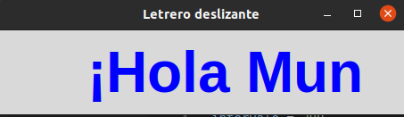

# Variables de Control

## Letrero Deslizante

#### Este programa hace que la frase "Hola Mundo" se 'deslize' por la ventana Tk, al tomar el largo de carácteres, restar el último, y sumar carácteres al texto para que el texto avanze un carácter a la derecha, y se repite el proceso.

, 