# Widgets

##  Widget Boton

#### Este widget consiste un botón al que se asocian funciones para realizar al presionarlo. En este caso es un cronómetro, al hacer clic en "Start", empieza, y en "Stop", se detiene.

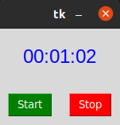

##  Widget Entry

#### El Entry nos permite escribir en la ventana Tk, y manipular los datos introducidos.

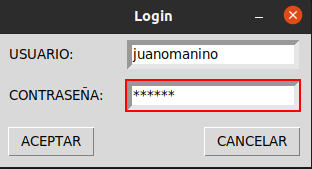

##  Widget Label Reloj

#### Este widget nos muestra la hora actual, modificando el texto de un Label y tomar los valores de tiempo directamente del PC.

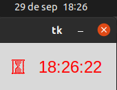

##  Widget Listbox

#### Muestra una lista de caŕacteres mediante una Stringvar, que al dar clic en uno, lo toma en una variable, para que al accionar el botón, muestre el "Hola" en el idioma de la String mostrada.

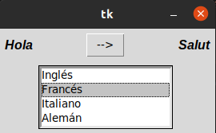

##  Widget Menu

#### La ventana tiene el widget Menu, que muestra de encabezado un texto,  y al clicarlo muestra una cascada de opciones.

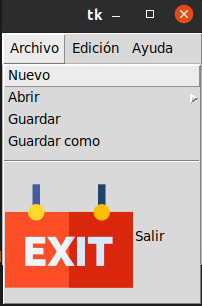

##  Widget Menu Boton

#### El widget despliega una serie de opciones al hacerle clic, y se pueden asociar comandos a dichas opciones, como poner cierto texto despues de hacer clic.

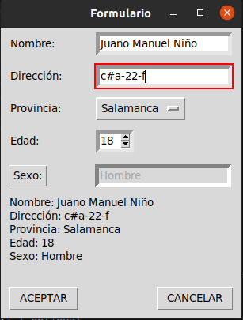

##  Widget MessageBox

#### Despliega una ventana con un mensaje, despues de llamar a una funcion con MessageBox.

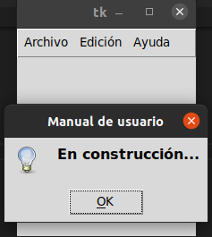

##  Widget Menu Opciones

#### En la ventana Tk, despliega una serie de opciones, y la hacer click a una, la deja como encabezado.

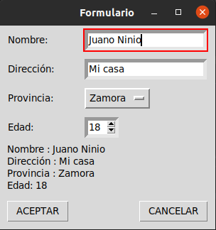

##  Widget Arco 

#### Usando el widget Scale, se crea la barra deslizante, que al moverla va modificando el arco de una canvas.

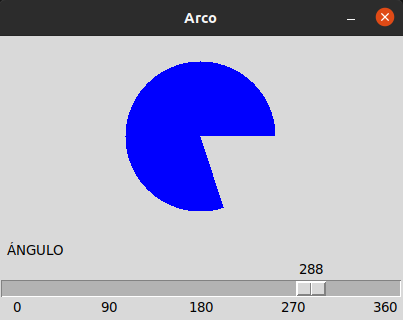

##  Widget Scroll

#### Se usa el widget Scroll para que una vez el texto sobrepase la capacidad de la ventana Tk en Y, esta siga bajando y se puede subir y bajar.

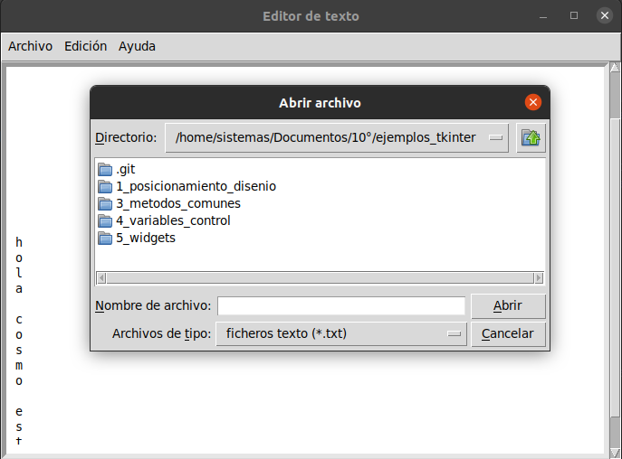

##  Widget Spinbox

#### Este widget permite hacer una lista entre x valores, y podemos modificar el número usando las flechas o escribiendo.

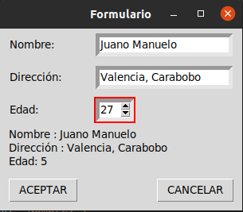

##  Widget Text

#### Se usa el widget Text para crear la zona en la que podemos escribir.

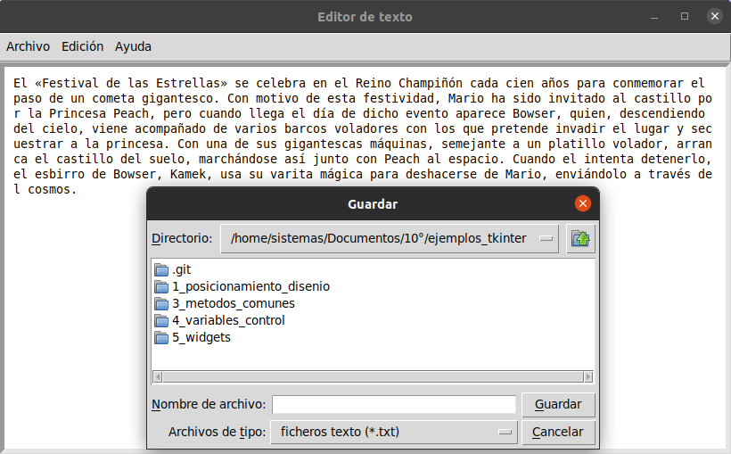

##  Widget Toplevel

#### Al usar el widget Toplevel, podemos crear una ventana extra, aparte de nuestra ventana principal Tk.

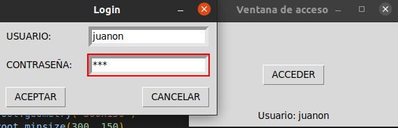