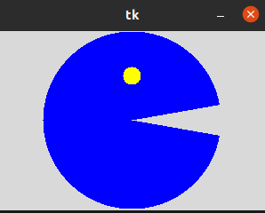
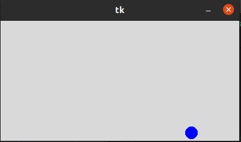
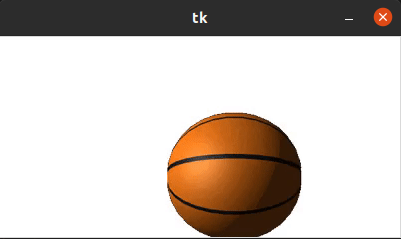
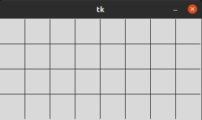
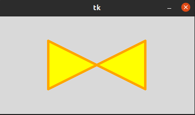
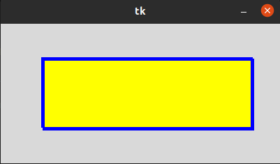
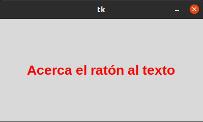
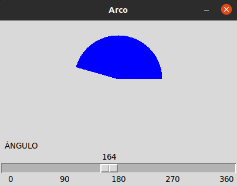

# Canvas y sus opciones

## Arco Canvas

#### Se crea un arco en la canva, con forma de Pac-Man y se asocian sus propiedades a distintas variables que cambian al llamar a una funcion, para que 'mueva' la boca.

## Círculo Canvas

#### Se crea un óvalo en las canvas, con ciertas variables numerales como propiedades que se suman y restan con números random, y al obtener las coordenadas de la pelota se suma y resta a desplazamientox y _y, para moverla.

## Imagenes Canvas

#### Sigue el mismo proceos que el anterior, pero la pelota es un gif o png

## Lineas Canvas

#### Se crea una cuadrícula usando una canva, definiendo como variables el ancho, largo e intervalo, para despúes usar el cliclo for para rear las líneas

## Polígonos Canvas

#### Se crea una canva en la ventana Tk, y se crea el polígono poniendo diferentes valores par ala forma que deseemos.

## Rectángulos Canvas

#### En una canva se crea el rectángulo poniendo 4 valores, 2 de coordenadas y 2 las dimensiones del polígono.

## Texto Canvas

#### Alc rear la canva, en su configuraión se pone el texto y se le asigna la propiedad de que al estar encima el cursor del mouse, cambie de color

## Arco Scale

#### Usando Scale en la canva, se crea la barra deslizante, que al moverla va modificando el arco de una canvas, al asociar su movimiento con el arco. El arco se crea del mismo modo que el Pac-Man.

